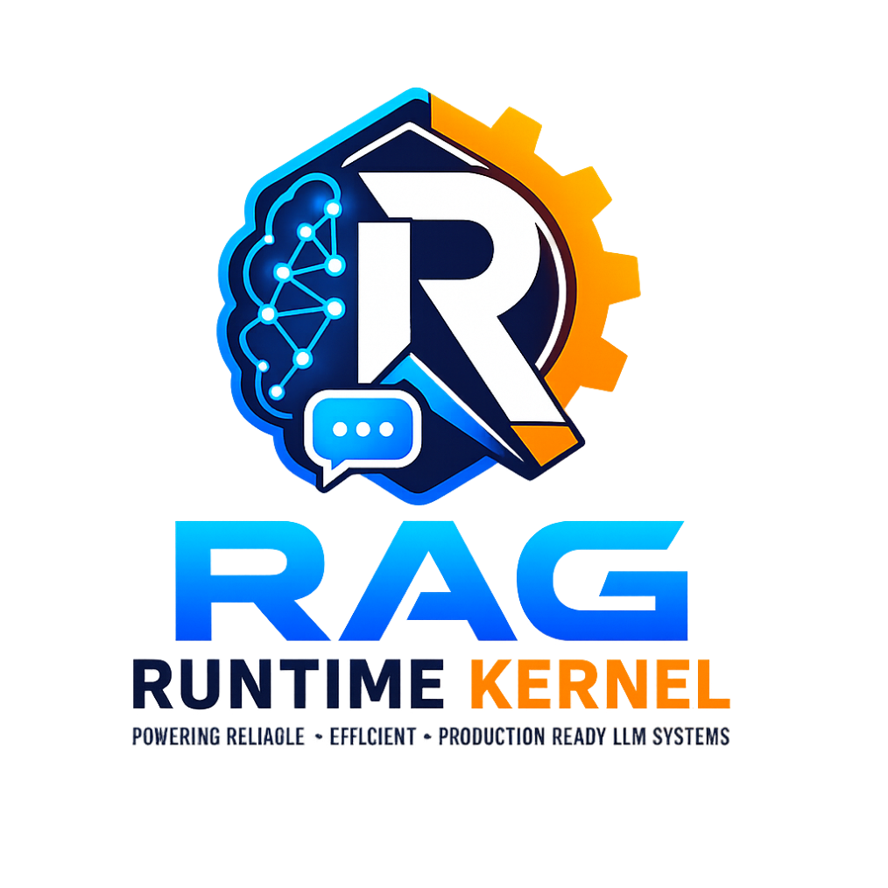

<p align="center">
  
</p>

# RAG Runtime Kernel

> **LLM proposes. System decides. State persists.**

Persistent memory and deterministic state control for any LLM. The kernel keeps state management **out of the language model** — bootstrap, validation, persistence, and crash recovery run as deterministic code, so the model spends its tokens on reasoning, not on bookkeeping.

It ships in **two tiers** so it fits both a non-technical user pasting one file into a chat, and a developer running a serious, long-lived, token-critical project on a hardened Python backbone.

---

## Choose Your Path

| | **Tier 1 — Simple** | **Tier 2 — Enforced** |
|---|---|---|
| **Who it's for** | Anyone. No Python, no Node, no install. | Builders of large, multi-session, token-critical projects who want hard guarantees. |
| **What you run** | One markdown specification, dropped into a chat session. | The `rag_kernel` Python runtime (MCP or HTTP server) alongside the spec. |
| **How rules are applied** | The LLM **self-enforces** the spec by instruction (autonomous). | The Python kernel **intercepts and validates** every state change. The LLM cannot bypass it. |
| **Determinism** | As reliable as the model following instructions. | Deterministic state machine — formally verified (TLA+) and covered by 1,082 passing tests. |
| **Token cost of state ops** | The model reads and reasons over the spec (~100 KB). | **Zero LLM tokens** for bootstrap, validation, persistence, and recovery — they run in Python. |
| **Version** | Specification **v3.2.0** | Runtime kernel **v0.4.0** |
| **Setup effort** | Seconds. Paste a file. | Minutes. Copy `rag_kernel/`, run one command. |

> **Same project, same RAG files.** Start in Tier 1 and graduate to Tier 2 without rewriting anything — the enforced runtime reads and writes the exact same `RAG/` state. Tier 2 is a strict superset of Tier 1.

> **On the two version numbers.** This repo tracks two things on separate version lines: the **specification** (the protocol the LLM follows — currently `v3.2.0`) and the **runtime kernel** (the Python engine that enforces it — currently `v0.4.0`). Tier 1 uses the spec alone; Tier 2 uses the runtime to enforce that spec.

---

## What Problem This Solves

Every LLM session starts from zero. Close the tab, lose the state. The common workarounds are fragile: chat-history dumps, vector stores that retrieve the wrong thing, and framework lock-in that breaks when you switch platforms. Underneath all of them sits a deeper problem — **the language model is doing its own bookkeeping.** Tracking what's done, what's pending, which decision superseded which, whether a write actually landed: every one of those is reasoning the model has to redo each session, and every one of them costs tokens and invites drift.

RAG Runtime Kernel moves that bookkeeping out of the model. State lives in plain files on disk. The lifecycle is a fixed state machine. And in **Enforced mode** the transitions, validation, and persistence are executed by deterministic Python — not proposed by the model and hoped for.

**The shift this represents (Tier 2):**

- **State management leaves the LLM entirely.** The model proposes a JSON action; the kernel validates it against policy and either commits or rejects it. The model never directly mutates state.
- **Bootstrap costs zero LLM tokens.** `rag_kernel init` parses the ~100 KB specification and produces `RAG_MASTER.json` deterministically — no model call. The work that used to mean "feed the model a 20K-token spec and ask it to build the RAG" is now a function call.
- **Determinism is proven, not asserted.** The state machine is verified with TLA+ (the same class of formal method Amazon uses for AWS) and exercised by 1,082 unit tests — all passing.

**What you get in both tiers:**

- **Persistence** — project state survives across sessions, tabs, and platforms.
- **Lean context** — HOT/COLD memory tiers keep only active state in the window; archival data loads on demand.
- **Audit trail** — every state transition, decision, and conflict is logged and traceable.
- **Conflict ledger** — when a new fact contradicts a stored one, both are preserved, never silently overwritten.

---

## Quick Start

### Tier 1 — Simple (no install)

Best for Claude Projects, ChatGPT, or any chat interface.

1. Open a new project or conversation.
2. Add [`INIT_UNIVERSAL_RUNTIME_KERNEL_v3.2.0.md`](INIT_UNIVERSAL_RUNTIME_KERNEL_v3.2.0.md) to the session as a file (it's a full specification, ~100 KB — it goes into a **project/session**, not the short system-prompt field).
3. Send: **"Initialize the project."** The LLM self-bootstraps, scans your folder if it has file access, and builds the `RAG/` state.
4. On ChatGPT / GPT Web without file tools: download the generated RAG files at session end and re-upload them at the start of each session to restore state.

That's it — no Python, no dependencies.

### Tier 2 — Enforced (Python runtime)

Best for long-lived, multi-session, token-critical projects where you want hard guarantees.

**1. Copy the runtime into your project:**

```bash
git clone https://github.com/arcadamarket/rag-runtime-kernel.git temp-clone
cp -r temp-clone/rag_kernel YOUR_PROJECT/rag_kernel
rm -rf temp-clone
```

<details>
<summary>PowerShell / CMD equivalents</summary>

```powershell
# PowerShell
git clone https://github.com/arcadamarket/rag-runtime-kernel.git temp-clone
Copy-Item -Recurse temp-clone\rag_kernel YOUR_PROJECT\rag_kernel
Remove-Item -Recurse -Force temp-clone
```

```cmd
:: CMD
git clone https://github.com/arcadamarket/rag-runtime-kernel.git temp-clone
xcopy temp-clone\rag_kernel YOUR_PROJECT\rag_kernel\ /E /I
rmdir /s /q temp-clone
```
</details>

**2. Bootstrap the RAG deterministically (zero LLM tokens):**

```bash
python -m rag_kernel init --spec RAG/INIT_UNIVERSAL_RUNTIME_KERNEL_v3.2.0.md --output RAG/
# optional: merge project-specific context
python -m rag_kernel configure --rag RAG/RAG_MASTER.json --context your_context.json
```

**3. Run the kernel as a server:**

```bash
python -m rag_kernel mcp   --project /path/to/your/RAG               # MCP mode (Claude Desktop)
python -m rag_kernel serve --project /path/to/your/RAG --port 7437   # HTTP mode (GPT Custom Actions / any client)
```

Every state mutation now flows through the kernel's proposal → validation → commit pipeline. Full platform-specific setup: [`docs/LAUNCH_MANUAL.md`](docs/LAUNCH_MANUAL.md).

> Works for **both new projects and existing ones**. On an existing project, the boot scan inventories your files, classifies them by tier, and extracts knowledge into COLD storage — your prior work becomes queryable, trackable, and persistent.

---

## What's Actually Proven

This section states only what is measured or formally verified — no marketing percentages.

**Determinism (Tier 2):**

- **1,082 / 1,082 unit tests passing** (runtime v0.4.0) across 19 runtime modules (state machine with TLA+-enforced transition guards, persistence/WAL, COLD manager, concurrency, conflict engine, schemas, HTTP API, MCP transport, spec parser, session logger, generated guards, guard generator, context-truncation policy, graph orchestrator, agent/session supervisor, and the DRIFT-ELIM project-state layer — item-lifecycle core, atomic mutation store, deterministic renders, and the fail-loud session auditor).
- **TLA+ formal verification:** the TLC model checker exhaustively explored **389,522 states (168,520 distinct)** to depth 19 and confirmed **8 safety invariants + 3 liveness properties with zero violations**. The TLA+ spec is a 1:1 transcription of the Python state machine. Two genuine liveness bugs were found and fixed during verification.
- **The verified model is now mechanically enforced at runtime (FV-PHASE4):** the state machine's transition table is *generated* from the TLA+ model and legality is checked through the generated predicate — the runtime can no longer drift from what TLC proved. A `guardgen --check` gate detects any model/code divergence.
- Unit tests prove "these 1,082 scenarios work." TLA+ proves "no reachable state can violate the invariants, and the system always makes progress." The second is a strictly stronger guarantee.

**Token economy (Tier 2):**

- **Bootstrap: 0 LLM tokens.** `rag_kernel init` parses the ~100 KB / ~20K-token specification in Python. No model is involved.
- **State operations: 0 LLM reasoning tokens.** Validation, atomic writes, WAL, checkpointing, COLD partitioning, and crash recovery all execute as code. The model's only job is to *propose*; it never spends tokens managing or re-deriving state.
- **Lean active context.** HOT memory holds only live state (on the order of ~15 KB); archival data is loaded on demand rather than carried in every prompt.

We deliberately do **not** publish a single headline "X% token savings" number — the honest claim is structural: the entire state-management layer is removed from the model's token budget. Your actual savings depend on your project size and platform.

---

## How It Compares

A positioning comparison, not a controlled benchmark. Full notes: [`docs/benchmark_comparison.md`](docs/benchmark_comparison.md).

| Capability | RAG Runtime Kernel | Claude Code | lean-ctx | LLM Wiki |
|---|---|---|---|---|
| **Cross-session memory** | Full: HOT/COLD + WAL + crash recovery | Partial: CLAUDE.md + auto-memory, no crash recovery | None (compresses I/O, doesn't persist state) | Pattern only |
| **Deterministic state machine** | Yes — formally verified (TLA+), 1,082 tests | No | No | No |
| **Where state work runs** | Off the LLM, in Python (Tier 2) | In-session, model-mediated | N/A — I/O compression layer | In the LLM / external tooling |
| **Token approach** | State ops cost **0 LLM tokens**; lean HOT boot | Grows without curation | **60–99% raw I/O compression (best in class)** | Depends on wiki quality |
| **Cross-platform** | Claude + GPT + any LLM, one spec | Claude Code CLI only | Editor-focused | Platform-agnostic pattern |
| **Dependencies** | Tier 1: none. Tier 2: Python only | Node.js + CLI | Rust binary | Varies |
| **Crash recovery** | WAL replay + .bak rotation + RECOVERY state | File-history checkpoints | N/A | None |
| **Conflict tracking** | Explicit ledger — both sources preserved | None | N/A | None |

**Honest take:** if raw token compression is your only goal, **lean-ctx wins** — it's purpose-built for that and pairs cleanly with this kernel (lean-ctx compresses the I/O layer; the kernel manages the state layer). Where this project is genuinely distinct is the combination of a **formally-verified deterministic state machine, atomic persistence with crash recovery, a conflict ledger, and one spec that runs across Claude and GPT** — no other system in this list offers that set.

---

## What This Is

A **specification** plus an optional **runtime that enforces it** — together they turn any LLM into a controlled, auditable agent with persistent project memory. Three layers:

```
LLM (reasoning engine)
  | JSON proposals
Policy Layer (the specification)
  | validated transitions
Runtime Kernel (state + persistence)   <- enforced by Python in Tier 2
  | atomic writes
Filesystem (source of truth)
```

In Tier 1 the LLM plays the role of the runtime by following the spec. In Tier 2 the Python kernel *is* the runtime, and the LLM can only propose.

---

## Formally Verified with TLA+

The state machine is verified using [TLA+](https://lamport.azurewebsites.net/tla/tla.html) and the TLC model checker — the same formal-methods technique [Amazon uses to verify AWS infrastructure](https://lamport.azurewebsites.net/tla/amazon-excerpt.html).

TLC exhaustively explored **389,522 states** (168,520 distinct) at depth 19 and verified all 8 safety invariants + 3 liveness properties with zero violations:

| Safety Invariant | What It Proves |
|---|---|
| TypeInvariant | All state variables hold valid types at all times |
| TransitionSafety | Every reachable state is legal per the transition graph |
| SingleWriter | At most one proposal staged at any time (no concurrent mutations) |
| WALConsistency | Write-ahead log is append-only, monotone, never lags behind state |
| TerminalSafety | CLOSING is irreversible — no exit, no crash, no pending proposals |
| NoDeadlock | Every non-terminal state has at least one enabled action |
| CrashRecoveryConsistency | Crash flag is only true when state is RECOVERY |
| WALPrecedesStateChange | WAL entry exists before any state transition commits |

| Liveness Property | What It Proves |
|---|---|
| EventualProgress | The system always eventually returns to READY from any reachable state |
| EventualTermination | CLOSING is stable — once reached, it stays (no infinite loops) |
| ProposalEventuallyResolved | A staged proposal always reaches COMMITTED, REJECTED, or NONE |

Phase 2 verification found and fixed two genuine liveness bugs: a BOOTING↔RECOVERY direct-transition loop, and a crash-at-full-WAL deadlock. The TLA+ specification (`formal/RAGKernel.tla`) maps 1:1 to the runtime code. Full results in [`formal/TLC_RESULTS.md`](formal/TLC_RESULTS.md).

---

## Core Features

**Structured Memory (HOT/COLD)** — Active state stays lean; archival data loads on demand with automatic partitioning.

**Deterministic State Machine** — `BOOTING → READY → WORKING → CHECKPOINTING → CLOSING` with a `RECOVERY` path.

**Proposal → Validation → Commit** — The LLM proposes JSON actions; the system validates against policy, then commits or rejects.

**Atomic Persistence** — All writes are atomic and hash-verified. A write-ahead log enables crash recovery.

**COLD Partitioning** — Auto-splits into sessions / inventory / conflicts / evidence with sub-partitioning and integrity-preserving chopping.

**Conflict Engine** — Auto-categorizes conflicts into 7 types, scores confidence, and auto-resolves low-risk cases; preserves both sides otherwise.

**Tool Fallback Chain** — Ordered fallback for file operations across platform tools.

**Cross-Platform** — Claude Projects, ChatGPT, Cowork, Claude Code, any LLM.

**Multi-Account Safety** — Session identity tagging, write-collision detection, anti-corruption guards.

**Full Audit Trail** — Every state transition, decision, and conflict logged.

---

## Using with Cowork

[Cowork](https://docs.claude.com) is Anthropic's desktop tool for non-developers to automate file and task management. Its direct file access lets the kernel read and write `RAG/` files with no manual copy-paste, and its task automation pairs naturally with the kernel's checkpoint and audit system. For a new project, drop the Init Prompt in and the system bootstraps and scans your folder; for an existing one, point it at the folder during bootstrap and your work becomes tracked state.

## Using with Claude Code

[Claude Code](https://docs.claude.com) is Anthropic's CLI for agentic coding. The kernel adds context persistence across its stateless sessions, a deterministic state machine to structure long-running development, zero-token file ops via direct filesystem access, and a conflict ledger that preserves both sides when new code contradicts a prior decision. Add a `RAG/` directory, bootstrap, and it starts tracking state.

---

## Prerequisites

**Tier 1 minimum:** an LLM that supports file uploads or long-form input, plus a project folder.

**Tier 2:** Python 3.10+. [Filesystem MCP](https://github.com/modelcontextprotocol/servers) recommended for direct file read/write; a shell/PowerShell MCP is optional.

## Repository Structure

```
rag-runtime-kernel/
├── INIT_UNIVERSAL_RUNTIME_KERNEL_v3.2.0.md   # The specification (Tier 1 + Tier 2)
├── INIT_UNIVERSAL_RUNTIME_KERNEL_v3.1.8.md   # Previous spec version (archived)
├── CONTRIBUTING.md                            # How to report issues
├── CHANGELOG.md                               # Version history
├── docs/
│   ├── architecture.md                        # System architecture
│   ├── benchmark_comparison.md                # Positioning vs alternatives
│   ├── design_principles.md                   # Core design philosophy
│   ├── test_analysis_gpt_web.md               # GPT Web platform findings
│   ├── LAUNCH_MANUAL.md                       # Full setup guide (all platforms + tiers)
│   ├── LOCAL_TESTING_GUIDE.md                 # Local dev testing & GPT Custom Actions
│   ├── v3.2_ARCHITECTURE_DESIGN.md            # Runtime architecture design doc
│   └── ROADMAP.md                             # Development roadmap
├── rag_kernel/                                # Tier 2 runtime kernel (v0.4.0)
│   ├── __init__.py                            # Package entry, discover() capability registry
│   ├── __main__.py                            # CLI (init / configure / health / serve / mcp / session / checkpoint / gc / graph / resolve / defer / render / note)
│   ├── api.py                                 # HTTP API (FastAPI)
│   ├── state_machine.py                       # Deterministic state engine
│   ├── persistence.py                         # Atomic writes, WAL, hash verification
│   ├── cold_manager.py                        # COLD partition manager
│   ├── concurrency.py                         # Lock manager, write-collision guard
│   ├── conflict_engine.py                     # Conflict auto-categorization (7 categories, auto-resolve)
│   ├── mcp_transport.py                       # MCP tool interface
│   ├── schemas.py                             # Pydantic models for proposals/state
│   ├── session_logger.py                      # Universal JSONL session observability
│   ├── spec_parser.py                         # Deterministic MD→RAG parser (zero LLM)
│   ├── guardgen.py                            # Deterministic TLA+ → Python guard generator (build-time)
│   ├── generated_guards.py                    # Generated, runtime-enforced transition table + guards
│   ├── context_policy.py                      # Kernel-enforced context-truncation policy (M-009)
│   ├── graph_orchestrator.py                  # Graph Orchestrator: DAG core + execution engine (v0.4.0)
│   ├── agent_supervisor.py                    # Graph Orchestrator: observable off-process worker supervisor / AgentView (v0.4.0)
│   ├── drift_control.py                       # DRIFT-ELIM: item-lifecycle core — ItemStatus enum + LIFECYCLE guards + immutable TrackedItem (v0.4.0)
│   ├── drift_store.py                         # DRIFT-ELIM: atomic mutation API over tracked_items + backlog migration; lifecycle CLI (v0.4.0)
│   ├── drift_render.py                        # DRIFT-ELIM: deterministic renders of open_tasks/deferred_items/backlog/ERROR_LOG from tracked_items (sole authority); render CLI (v0.4.0)
│   └── drift_audit.py                         # DRIFT-ELIM: fail-loud session-boundary auditor — render parity, supersede refs, note/status, side-store scan (v0.4.0)
├── tests/                                     # 1,082 tests (v0.4.0 release)
├── .github/                                   # FUNDING.yml + issue templates
├── formal/
│   ├── RAGKernel.tla                          # TLA+ state machine specification
│   ├── RAGKernel.cfg                          # TLC model checker configuration
│   └── TLC_RESULTS.md                         # Verification results (389K states, 8 safety + 3 liveness)
├── LICENSE                                    # AGPL-3.0
└── README.md
```

## Session Lifecycle

1. **BOOTING** — Load HOT, verify consistency, check WAL, probe tools.
2. **READY** — Accept tasks.
3. **WORKING / INGESTING** — Execute tasks, ingest files, extract knowledge.
4. **CHECKPOINTING** — Save atomically with backup rotation.
5. **CLOSING** — Audit findings, final save.

## Disclaimer & Known Limitations

- **Tier 1 is self-enforced** — the LLM follows the spec by instruction, not by hard runtime constraints. For hard guarantees, use Tier 2.
- **Persistence depends on platform** — full atomic writes with file/MCP access; manual file management on GPT Web (no atomic writes, no real token counter).
- **Context window ceiling** — the spec is ~100 KB / ~20K tokens; in Tier 1 it occupies the window, so very large projects may hit limits. Tier 2 keeps the spec out of the model via deterministic parsing.
- **Single-writer** — concurrent writes are detected and halted, not auto-merged.
- **Not a database** — this is structured file-based memory, not a production database replacement.

See [`docs/test_analysis_gpt_web.md`](docs/test_analysis_gpt_web.md) for platform-specific findings.

## Roadmap

See [`docs/ROADMAP.md`](docs/ROADMAP.md) for the complete roadmap.

| Line | Version | Status | Focus |
|---|---|---|---|
| Spec | **v3.2.0** | Released | Operational hardening, 51 sections: Web Access Protocol, Environment Audit, strengthened tier/env-switch gates, session-zero requirements + known-issues inheritance. |
| Runtime | **v0.3.0** | Released | 13 modules, 758 tests. TLA+ guards **enforced** at runtime (FV-PHASE3/4) — transition table generated from the model, `guardgen`/`generated_guards` registered; **M-009** kernel-enforced context-truncation policy (per-region token accounting, deterministic eviction, HOT never evicted, checkpoint/evict/halt). |
| Runtime | **v0.2.7** | Released | 12 modules, 676 tests. Graduated POV, delta checkpoints, conflict auto-categorization engine, session logger, session/checkpoint/gc CLI, spec enforcement. |
| Runtime | **v0.2.0** | Released | Zero-touch bootstrap (`rag_kernel init`), capability self-discovery (`discover()`), project configuration (`rag_kernel configure`). |
| Runtime | **v0.4.0** | Released | **Graph Orchestrator** — DAG execution, dependency tracking, deterministic-levels + OS-process parallel scheduling, checkpoint-per-node, transactional rollback, and an observable agent/session supervisor; runtime-wired via `KernelApp.run_graph`, CLI `rag_kernel graph run`, and MCP `rag_graph_run`. **DRIFT-ELIM** (deterministic project-state layer) — item-lifecycle core, atomic mutation API over `tracked_items` + backlog migration, the `rag_kernel resolve\|defer\|…` lifecycle CLI, deterministic **renders** making `tracked_items` the sole authority (legacy `open_tasks`/`deferred_items`/backlog become projections via `rag_kernel render`), and a fail-loud session auditor that asserts render == canonical. 19 modules, health 20/20, 1,082 tests. |

## Reporting Issues

Found a bug? Please [open an issue](../../issues/new/choose) using the provided templates. See [`CONTRIBUTING.md`](CONTRIBUTING.md).

## Support

**Developer:** Artem Pakhol
**LinkedIn:** [linkedin.com/in/pakhol](https://www.linkedin.com/in/pakhol)

## License

Licensed under the [GNU Affero General Public License v3.0](https://www.gnu.org/licenses/agpl-3.0.html) — see [LICENSE](LICENSE).

**What this means:** you may use, modify, and distribute this software, but any modified version you deploy (including as a network service) must also be released under AGPL-3.0 with attribution to the original project.
